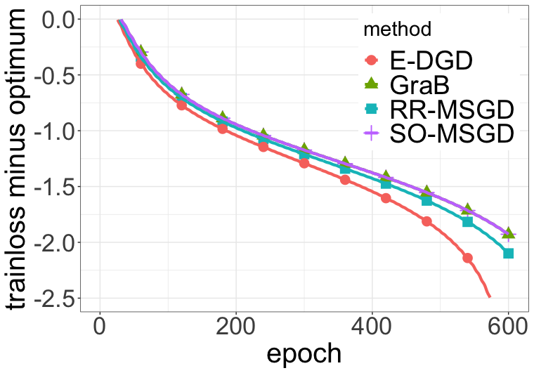

# Data-driven Subsampling Based Stochastic Gradient Descent Method

This repository provides an implement of **D**ata-driven subsampling based stochastic **G**radient **D**escent (**DGD**). 

**DGD** has the following three steps.

* Encode figures by ViT model and get the features.
* Get the order of features by DDS.
* Use a simple MLP to predict the labels.


## Requirement

Built Using Languages and Libraries Listed Below  

* [Python](https://docs.python.org/3/)
* [numpy](https://numpy.org/devdocs/)
* [PyTorch]([PyTorch](https://pytorch.org/))
* [Pandas]([pandas - Python Data Analysis Library (pydata.org)](https://pandas.pydata.org/))
* [GraB]([EugeneLYC/GraB: Source code for the GraB paper. (github.com)](https://github.com/EugeneLYC/GraB))
* [UniDOE (R package)](https://cran.r-project.org/src/contrib/Archive/UniDOE/)

Or in tabular form

| Environment        | version |
| ------------------ | :-----: |
| Python             |   3.9   |
| numpy              | 1.23.5  |
| PyTorch            |  2.0.1  |
| Pandas             |  1.5.3  |
| GraB               |   1.0   |
| UniDOE (R package) |  1.0.2  |


## Usage

1. Encode figures

```python
Python train_feature.py
```

2. Get the order

   Run in rearranged_dds.R.

```R
cifar10=read.csv(file = 'data/cifar_train.csv')
cifar10=as.matrix(cifar10,nrow=50000,ncol=769)
cifar10=as.matrix(cbind(cifar10[,770],cifar10[,2:769]))
GLP_500_15=GLP(500,15)
cifar_re2500=rearrange_DDS_regress_without(cifar10,500,divided.number = 5,Design=GLP_500_15,reduced.dim = 15)
write.csv(cifar_re2500$rearrange_data, file='data/cifar_rearranged_2500.csv')
```

3. Predict the labels

```python
Python cifar_train.py
```


## Details

**DGD** encodes the figures by two methods. 

For one channel figures like MINST, we directly flatten them as the features and we use the LeNet as the predictor. As for three channel figures like Cifar10, we use an encoder. Here, we choose [ViT_base_16_224](https://github.com/google-research/vision_transformer) as the encoder and a MLP with one hidden layer as the predictor.  


## Results

Train loss and test loss on Cifar10.




